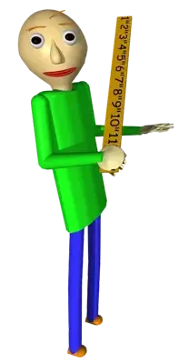

# HTTP Runner
My entry for the JS13K 2020 Game Jam. This year's theme was **404**.

## How to play

You play as an HTTP request and you must find all the 5 files in each stage to
progress. However, you must not get caught by the firewall agent, which has
gone haywire and is targetting innocent requests such as yourself. Use the
WASD keys or arrow keys to move. Get all the files and get to the exit to go to
the next stage. Clear all 5 stages to win.

## Building and running

Before running this project for the first time you must install the required
dependencies
```
npm install
```

To run the project just run
```
npm start
```

To bundle eveything into a single HTML file and compress it, run
```
npm run build
```
## Post-mortem

I finally managed to submit another entry to JS13k, 7 years after my last participation! With a few years of experience under my belt, I decided it was time to try my hand once again and see if my game development skills had improved whatsoever.

### Inspiration

The first two weeks were... well, not really productive. I had a hard time splitting my time between work, other projects, keeping my sanity during a pandemic and the game. Considering that I stopped catching up with modern Javascript standards a long time ago (is Angular still a thing?) and didn't have any idea on what kind of game I would make, the task felt extremelly daunting. For this reason, I unintentionally postponed the actual start of the development by two weeks.

At this point, I started having some ideas about creating a maze where you would need to collect some files to get to the next level. After getting this initial idea, I was talking to a friend (Hi Louise!) and she mentioned the game "Baldi's Basics in Education and Learning" and how I could do something similar. I absolutelly loved the idea and decided to go in that direction.



In this game, you must get all the notebooks scattered around in a school while being followed by the teacher, Baldi. After getting the notebooks without getting caught, you must head to the exit to finish the game. Baldi becomes slightly faster for each notebook you get.

The idea for my game is pretty similar, but in a top-down 2D maze environment.

### Preparation

Since my knowledge of Javascript was pretty rusty, I tried to use as much pre-made boilerplate as I could. I used [js13k-webpack-starter](https://github.com/sz-piotr/js13k-webpack-starter) to manage the process of development and building, and I had [kontra.js](https://github.com/straker/kontra) as my framework of choice.

### Development

The first part I had to deal with was generating the maze. I had always heard about maze-generation algorithms but never bothered to know how they worked. [This](http://weblog.jamisbuck.org/2011/2/7/maze-generation-algorithm-recap) was a great resource to get an overview on the different algorithms out there and [this](http://weblog.jamisbuck.org/2010/12/27/maze-generation-recursive-backtracking) was my reference on how to implement the recursive backtracking algorithm (and then I realized that this is basically just a depth-first search).


One thing that I realized is that in a maze you would have a single path between any two points. Therefore the player could be put in situations were they wouldn't be able to get all the files without getting caught by the enemy. At first I didn't know how to solve it, so I moved on. After the initial maze was done, implementing the player was simple enough, and then I began implementing the enemy. This involved using some path-finding algorithms, and since the map was small enough, I thought that a simple Dijsktra implementation would probably do the job. But I also knew that A* was probably a better approach, and used the opportunity to actually implement it. [This](https://www.redblobgames.com/pathfinding/a-star/introduction.html) post helped me a lot while implementing the algorithm, and I used the priority queue implementation from [here](https://truetocode.com/binary-treemax-heap-priority-queue-and-implementation-using-javascript/427/) (because why re-invent the wheel?).

My first attempts were a bit unsuccessful, and to get a better idea of what was wrong I switched to a simple Dijkstra approach and added some debugging features. The program draws, in each square, how many steps the enemy would take to get to it. This is drawn only for explored tiles.


Wait... what?

Well, there were actually some silly mistakes when I used the priority queue, but after fixing these I got the expected result.


Even though it was a mistake probably not worth mentioning, I thought the animations were cool enough to be here. After that was fixed, I switched back to A* and moved on.

The map displayed in these animations was another idea I had, in which many rooms would be randomly generated and linked via corridors. This would fix the problem with impossible mazes mentioned before. But after developing the rooms for a while I figured that this would be too easy, since the corridors between rooms would give the player enough space to outrun the enemy whenever they wanted. To fix the issue with the maze, I decided to change the algorithm so that it deletes a random wall whenever it leaves a cell which is finished processing. At first I thought this strategy would completely destroy the maze, but after implementing it I was actually happy with the result.

Finally, I wanted to add some audio to the game so it would be a bit more exciting, and so that I could try to put my very limited music theory knowledge to the test. To save space, I wanted to generate the sounds within the code itself. I had the idea to generate a random tune for the game everytime it was played, using a pentatonic major scale. Since it doesn't contain any dissonant intervals, it would generate a reasonably acceptable melody. The problem is that it probably wouldn't be very interesting (try hitting random black keys in a piano), and it wouldn't give any identity to the game. So I decided to write a simple motif in a minor scale to give it some tension. Interestingly enough, while writing this post-mortem, I discovered a common motif called [Mysterioso Pizzicato](https://en.wikipedia.org/wiki/Mysterioso_Pizzicato) which I actually thought about while trying to come up with a melody! It is so interesting how some pieces of music are just so ingrained in the common knowledge that we have them subconsciously in our heads even when we're trying to come up with something original!

One annoying thing is that the enemy movement sound had a "click" after it finished. After some research, I discovered that this is caused by the sound being suddenly "cut". To fix it, I added an exponential decay to the volume before the sound stops. This fixed the problem in Chrome, but it persisted in Firefox. If anyone knows how to fix this issue, I would love to hear about it!

### Conclusion
In the end, I am very glad that I joined this competition. It encouraged me to learn more about algorithms, sound systhesis in Javascript, modern Javascript standards, and much more. Of course I see lots of room for improvement in the game, but given the constraints I am satisfied with the result, and very happy about the experience.